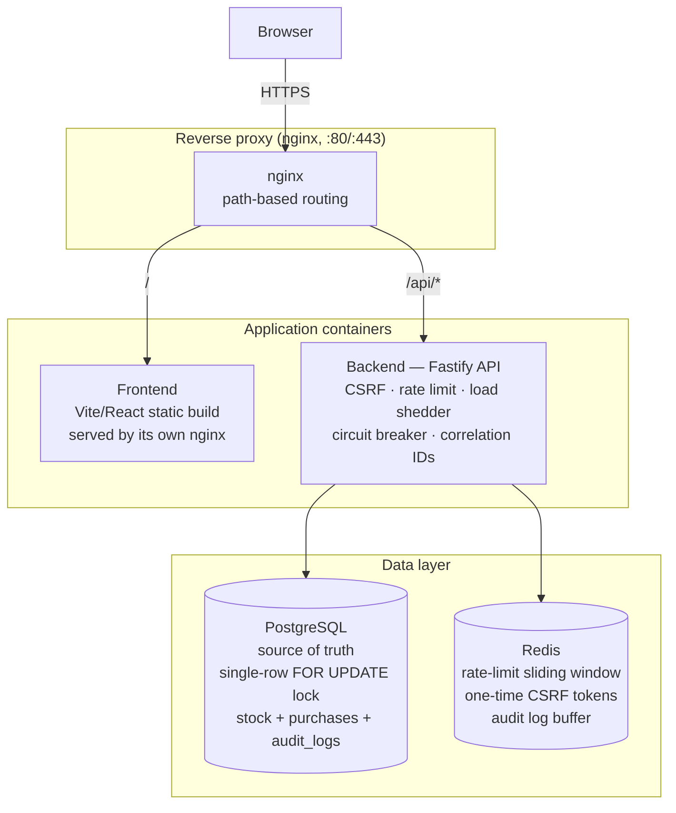

# Flash Sale — High-Throughput Purchase System

A flash sale platform for a single, limited-stock product: a configurable
sale window, one purchase per user, no overselling under concurrent load,
and a small React/Vite frontend to drive it. Backend is Fastify +
PostgreSQL + Redis; frontend is a clean, minimalist, Japanese-inspired UI.

```
POST /api/v1/purchase          → buy attempt
GET  /api/v1/status             → upcoming | active | ended, stock, countdown
GET  /api/v1/purchase-status    → did this user already secure one?
```

## Contents

- [Design choices & trade-offs](#design-choices--trade-offs)
- [System diagram](#system-diagram)
- [Project layout](#project-layout)
- [Running it](#running-it)
- [Testing](#testing)
- [Stress testing](#stress-testing)
- [API reference](#api-reference)
- [Known limitations / next steps](#known-limitations--next-steps)

## Design choices & trade-offs

### Concurrency control: one row, one lock, no oversell

There is exactly one product row for this sale. Every purchase attempt
opens a Postgres transaction that does:

```sql
SELECT id, stock, version FROM flash_sale_items ORDER BY created_at ASC LIMIT 1 FOR UPDATE;
-- already purchased by this user? → reject
-- stock <= 0?                     → reject
UPDATE flash_sale_items SET stock = stock - 1, version = version + 1 ...;
INSERT INTO purchases (user_id, item_id, correlation_id) ...;
```

`FOR UPDATE` takes a row lock on that single item, so **every purchase
attempt in the whole system is serialized through this one transaction** —
there is no window where two concurrent requests can both see `stock = 1`
and both decrement it. This is the actual mechanism that prevents
overselling; everything else (rate limiting, CSRF, circuit breaker) is
about protecting the system from *abusive or excessive* load, not about
correctness of the stock count.

**One purchase per user** is enforced inside that same locked transaction
with a plain `SELECT` against `purchases (user_id, item_id)` before the
insert. Because the row lock already serializes every attempt for this
product, that check can't race — there's no concurrent window in which two
requests for the same user could both pass it. A `UNIQUE (user_id,
item_id)` constraint on `purchases` backs this up as defense-in-depth (a
23505 unique-violation is caught and mapped to the same "already
purchased" response), in case a future change ever bypasses the lock.

### Why there's no separate optimistic-locking pre-check

An earlier version of this code fetched the item's `version` *before*
opening the transaction, then compared it against the version read inside
the `FOR UPDATE` block, rejecting on mismatch — classic optimistic
locking. That's actively wrong here: because the single row's lock already
serializes everything, by the time a queued transaction reaches the front
of the line under real concurrency, the version it captured before joining
the queue is almost always stale. The result: most concurrent purchase
attempts would fail with "version mismatch" even while stock remained,
which is exactly the failure mode a flash sale can't afford. Removing the
pre-fetch and doing the version bump only as an audit trail inside the
already-locked transaction fixed it. The stress test below is what
surfaced this originally.

### Why PostgreSQL is the source of truth, not Redis

Redis is fast and a common choice for flash-sale counters, but an
in-memory decrement (even with `WATCH`/`MULTI` or a Lua script) trades
durability for speed: a Redis failover or an unflushed AOF window can lose
or double-count purchases, and reconciling that against a "real" database
after the fact is exactly the kind of bug this system exists to avoid.
Postgres row locking is durable, transactional, and — for a single-SKU
sale — plenty fast (the stress test below sustains ~700 req/s locally
against a single unpooled dev instance). Redis is instead used for the
things that are fine to be best-effort or ephemeral:

- **Rate limiting** — a Redis sorted-set sliding window per user
  (`services/rate-limit`-style logic in `redis.repository.ts`), independent
  of the purchase-correctness path.
- **One-time CSRF tokens** — issued via `GET /api/v1/csrf-token`, stored
  with a TTL, deleted on first use (`redis.repository.ts#verifyCsrfToken`).
- **Audit log buffer** — a fast append-only list mirrored into the
  Postgres `audit_logs` table for permanent storage.

### Circuit breaker & load shedder

`middleware/load-shedder.ts` caps in-flight concurrent requests
(`maxConcurrentRequests`) and returns 503 once the ceiling is hit, instead
of letting the process fall over under an unbounded request queue.
`middleware/circuit-breaker.ts` trips (CLOSED → OPEN) after a run of real
server-side (5xx) failures and short-circuits new requests for a cooldown
window before probing again (HALF_OPEN). It's deliberately wired to only
count 5xx faults (`src/index.ts`'s error handler) — expected business
rejections like "out of stock" or "already purchased" are routine 4xx
responses under a flash sale and shouldn't trip a breaker meant to protect
against real degradation.

### Frontend: same-origin `/api`, no CORS on the common path

The frontend never hardcodes a backend host. In dev, Vite proxies `/api`
to the backend (`vite.config.ts`); in the containerized topology, nginx
proxies the same path to the `backend` service. The browser only ever
talks to one origin. The backend's CORS middleware still exists as a
fallback for anyone hitting it directly from a different origin, but it's
not on the primary path.

### Frontend: visual design

A deliberately quiet, minimalist look inspired by Japanese design
conventions — washi-paper backgrounds, a single restrained vermillion
(朱, *shu-iro*) accent reserved for the primary action and a small
seal-like mark, generous whitespace, a serif display face for the product
name paired with a plain system sans everywhere else. No UI framework —
plain CSS custom properties keep it small and fully auditable. It responds
to `prefers-color-scheme` for a dark variant of the same palette.

## System diagram



- **nginx** terminates the connection and routes by path — `/` to the
  static frontend build, `/api/*` to the backend. This is the only origin
  the browser talks to.
- **Backend (Fastify)** does request-level protection (CSRF, per-user rate
  limiting, load shedding, circuit breaking, correlation-ID logging) before
  ever touching the database, then serializes the actual purchase through
  a single Postgres transaction.
- **PostgreSQL** is the only place stock is ever decremented — see
  [Concurrency control](#concurrency-control-one-row-one-lock-no-oversell)
  above.
- **Redis** backs everything that's fine to be best-effort: rate limiting,
  one-time CSRF tokens, and a fast audit-log buffer that's mirrored into
  Postgres for permanent storage.

## Project layout

```
packages/
  server/    Fastify API (TypeScript) — see src/{routes,services,repositories}
  frontend/  Vite + React UI (TypeScript)
docker-compose.yml       Postgres + Redis only, for local `npm run dev`
docker-compose.prod.yml  Full self-contained stack: nginx + frontend + backend + its own Postgres/Redis
nginx.conf                Reverse-proxy config used by docker-compose.prod.yml
```

## Running it

Uses Node 20 (see `.nvmrc`, matches the Dockerfiles and CI) — `nvm use` if
you have nvm installed. Running on a much newer Node can hit real
compatibility gaps in the toolchain: this repo's own frontend test suite
silently broke on Node 22+ because jsdom@24 can't construct
`window.localStorage` once Node's own experimental `localStorage` global
(unflagged, non-functional without `--localstorage-file`) is present —
nothing to do with this project's code, but it fails the exact same way.

### Local dev (hot reload)

```bash
docker compose up -d postgres redis     # infra only, matches packages/server/.env defaults
npm install                             # installs both workspaces
npm run dev                             # backend on :3001, frontend on :3000
```

Open http://localhost:3000. The sale window defaults to starting 1 minute
after the backend boots and running for 5 minutes if `SALE_START`/
`SALE_END` aren't set — see `.env.example` to pin an explicit window.

### Frontend only (backend not running)

The frontend package is fully decoupled from the backend and never renders
blank if it can't be reached — the homepage, product card, and buy button
all still render; only the live data (stock/countdown) is affected, showing
a "Could not connect to the server. Retrying…" line until the backend comes
back (it polls, so recovery is automatic — no reload needed):

```bash
npm run dev:frontend                    # vite dev server on :3000, no backend needed
# or, fully containerized and standalone:
docker compose -f docker-compose.prod.yml up -d --build frontend
```

The frontend's own nginx (`packages/frontend/nginx.conf`) resolves the
`backend` upstream per-request rather than at startup, so the container
above starts and serves fine even with no backend anywhere on the network —
`/api/*` calls just fail until one shows up.

### Full containerized stack (nginx + both apps + their own Postgres/Redis)

```bash
docker compose -f docker-compose.prod.yml up -d --build
```

Open http://localhost — nginx serves everything from one origin. This
stack is fully independent of the dev-only `docker-compose.yml` (separate
container names, network, and volumes), so both can coexist if needed.

## Testing

### Unit + integration tests

```bash
docker compose up -d postgres redis     # tests run against the real DB, not mocks
cd packages/server
npm test
```

23 tests across two files:

- **`src/tests/unit.test.ts`** — pure logic: the tri-state sale-window
  calculation, circuit breaker state transitions, load shedder concurrency
  accounting, metrics percentile math. No DB required for the assertions
  themselves (the shared test setup still connects, since the other file
  needs it).
- **`src/tests/purchase.integration.test.ts`** — exercises the real
  Fastify app (`buildServer()` from `src/index.ts`) against real
  Postgres/Redis via `app.inject()`. Covers CSRF (issue-once, one-time
  use), input validation, sale status, rate limiting, admin auth, and two
  correctness proofs under genuine concurrency:
  - **No oversell**: 70 concurrent purchase attempts (distinct users)
    against 20 units of stock — asserts exactly 20 succeed, the rest get
    "out of stock", and the DB's final stock/purchase-count match exactly.
  - **One-per-user under a race**: 5 concurrent purchase attempts, same
    user, different CSRF tokens — asserts exactly 1 succeeds.

Why real Postgres instead of mocks: the entire point of this exercise is
proving the database-level locking holds under concurrency. A mocked
repository would test the mock, not the guarantee.

## Stress testing

`src/scripts/stress-test.ts` drives real HTTP traffic at an **already
running** server instance — it's not an in-process test, it's the same
network path a real browser would take.

```bash
# with the dev server already running (npm run dev, or npm run start after a build)
npm run test:stress -- --stock=200 --users=1000 --concurrency=200
```

It resets state by connecting to Postgres/Redis directly (same as the app
does), then runs two phases against the live server:

- **Phase A — no oversell at volume**: N distinct users compete for a
  fixed stock, fired in concurrent batches. Asserts successes exactly
  equal the stock, and that the DB agrees.
- **Phase B — one-per-user under a race**: many concurrent attempts, one
  user, asserts exactly one succeeds.

It prints throughput, p50/p95/p99 latency, and an outcome breakdown, then
exits non-zero if either invariant was violated.

**Actual local run** (150 stock, 750 competing users, batches of 150,
plus a 25-way same-user race — single dev-machine instance, unpooled
Postgres, no horizontal scaling):

```
--- Phase A: distinct users vs. limited stock ---
requests: 750, wall time: 1087ms, throughput: 690.0 req/s
latency ms - p50: 118, p95: 381, p99: 393, max: 395
outcomes:
     600  400 (Out of stock)
     150  201 (Purchase successful)
PASS: no overselling - successes exactly match available stock.

--- Phase B: same user, concurrent attempts ---
requests: 25, wall time: 30ms, throughput: 833.3 req/s
outcomes:
      24  400 (You have already purchased this item)
       1  201 (Purchase successful)
PASS: exactly one purchase succeeded for the racing user.
```

Both invariants hold exactly — final stock and purchase count in the
database matched expectations to the unit. Latency rises with batch size
because every request funnels through the same row lock (by design); the
fix for higher sustained throughput is horizontal scaling of the backend
(the lock is in Postgres, not in-process, so that scales safely) and a
larger connection pool, not relaxing the locking.

## API reference

| Method | Path                     | Notes                                             |
| ------ | ------------------------ | -------------------------------------------------- |
| GET    | `/api/v1/status`         | `{ item, status, saleActive, stockRemaining, timeRemaining }` |
| GET    | `/api/v1/csrf-token`     | One-time token, required by `/purchase`            |
| POST   | `/api/v1/purchase`       | `{ userId, csrfToken }`                             |
| GET    | `/api/v1/purchase-status?userId=` | `{ hasPurchased, purchaseId? }`           |
| GET    | `/health`, `/metrics`    | Liveness + Prometheus-style metrics                 |
| GET    | `/admin/metrics`, `/admin/purchase-log` | Require `X-Admin-Key` header          |
| GET    | `/docs`                  | Swagger UI                                          |

Full interactive docs at `/docs` once the backend is running.

## CI/CD

`.github/workflows/deploy-aws.yml` runs on every push and PR to `main`:

- **`test-server`** — lints and type-checks the backend, then runs the
  full unit + integration suite (including the concurrency proofs)
  against real Postgres/Redis service containers.
- **`test-frontend`** — type-checks and runs the frontend test suite.
- **`build-and-push`** / **`deploy`** — only run on a direct push to
  `main`, and only after both test jobs succeed (`needs: [test-server,
  test-frontend]`). A PR that fails either test job never reaches a build,
  and a broken `main` can't reach ECS.

## Known limitations / next steps

- **Dependency versions**: `npm audit` flags Fastify 4.x, `@fastify/static`
  (a transitive swagger-ui dependency), and a couple of dev-only tooling
  packages with known advisories that only resolve via a major-version
  bump (Fastify 5, etc.). That's a real migration with its own testing
  surface, deliberately left as a follow-up rather than rushed in.
- **Single-item-row model**: the whole locking strategy leans on there
  being exactly one product row. That's correct for this spec ("a single
  product") but wouldn't generalize to a multi-SKU flash sale without
  per-item locking and a different concurrency story.
- **In-process circuit-breaker/load-shedder/metrics state**: these are
  per-instance, in-memory singletons — this is deliberate, not an
  oversight. Per-user rate limiting is *not* in this category: that's
  already a Redis sorted-set shared across every instance
  (`redis.repository.ts#isRateLimited`), so it stays correct with any
  number of backend replicas. Circuit breaker and load shedder are kept
  local on purpose: they exist to protect *this process* (its own
  in-flight request count, its own view of recent 5xx faults), and both
  are on the hot path of every request. Moving them into Redis would add
  a network round trip to every single request just to ask "should I
  proceed?", and would make the safety net depend on the exact
  infrastructure (Redis) that a circuit breaker should keep working
  without if Redis itself is what's degraded. With multiple replicas,
  each one still independently opens its breaker under sustained 5xx
  faults (they all see the same failing Postgres), just not in perfect
  lockstep — a small, acceptable gap for what these checks are for.
  Prometheus-style metrics are per-instance by design too; aggregation
  across replicas happens at scrape time, not in the app.
- **No admission control ahead of the database**: every purchase attempt
  is serialized through one Postgres row lock (see [Concurrency
  control](#concurrency-control-one-row-one-lock-no-oversell)), which is
  correct and fast enough at this scale (~700 req/s locally, single
  unpooled instance). At a much larger scale — 100x the traffic, not 2x —
  that lock itself becomes the bottleneck, even though it's never wrong.
  The next architectural step at that point is a "waiting room": issue
  each incoming user a ticket (e.g., a Redis-backed queue or token
  bucket) and only let a trickle of tickets through to actually attempt
  the database transaction, instead of letting every request queue up
  behind the row lock directly. Not built here because it's unneeded
  complexity for a single-SKU sale at this traffic level — it's the
  answer to "what changes at 100x," not to this spec.
