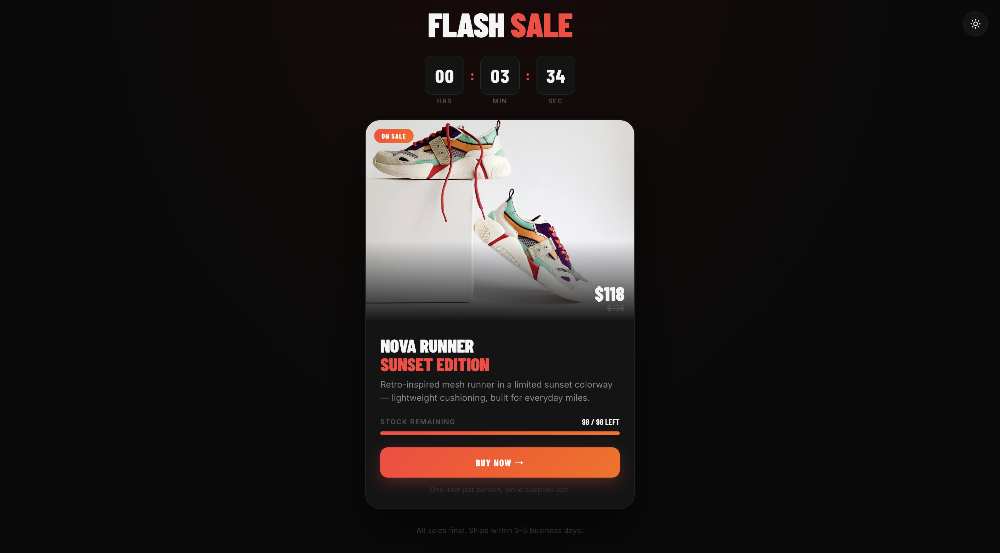
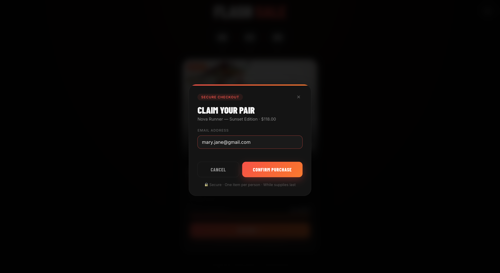
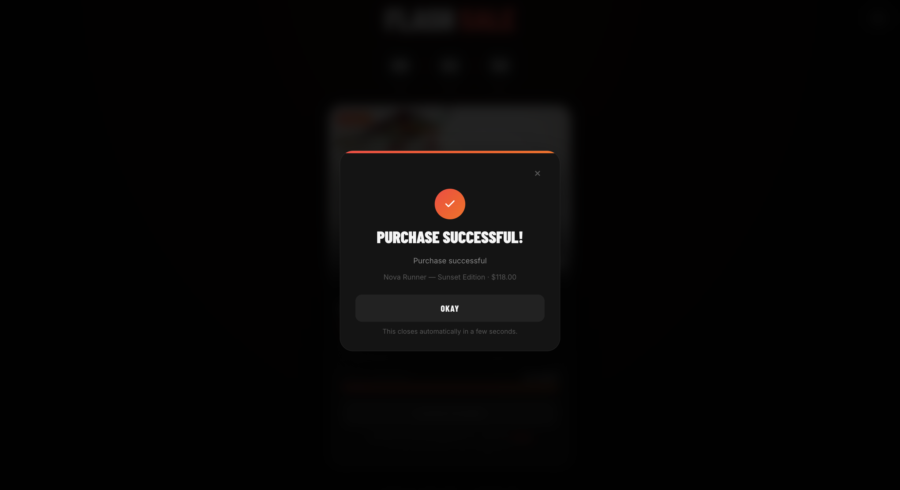
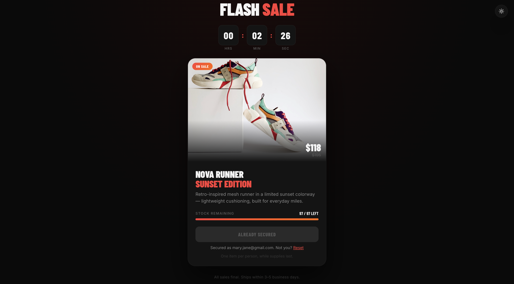
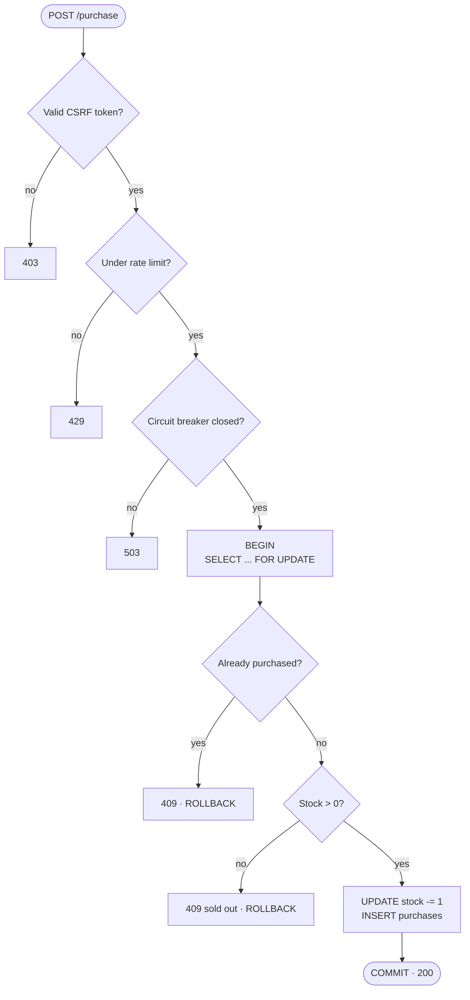
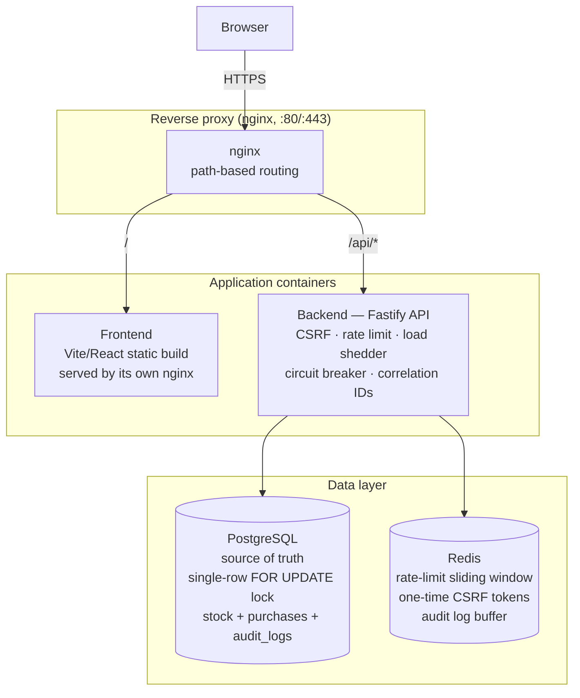

# Flash Sale — High-Throughput Purchase System

A flash sale platform for a single, limited-stock product: a configurable
sale window, one purchase per user, no overselling under concurrent load,
and a small React/Vite frontend to drive it.

**Stack:** Fastify (Node/TypeScript) API + PostgreSQL + Redis on the
backend, React + Vite on the frontend, Docker for packaging, deployed to
AWS ECS.

```
POST /api/v1/purchase          → buy attempt
GET  /api/v1/status             → upcoming | active | ended, stock, countdown
GET  /api/v1/purchase-status    → did this user already secure one?
```

If this is your first time in the repo, start at [Quick start](#quick-start)
— it gets you to a running sale in under five minutes. The rest of this
doc is organized so you can jump straight to what you need: architecture
if you're evaluating the design, the API/config sections if you're
building against it, Docker if you're deploying it.

## Screenshots

The countdown, stock meter, and checkout modal, in dark mode:

| Browsing | Checkout |
| --- | --- |
|  |  |

| Confirmed | Returning visitor |
| --- | --- |
|  |  |

Light/dark mode is a toggle in the top-right corner (`useTheme` hook);
it defaults to the visitor's OS preference.

## Contents

- [Quick start](#quick-start)
- [How it works](#how-it-works)
- [Purchase flow](#purchase-flow)
- [Architecture](#architecture)
- [Project layout](#project-layout)
- [Configuration — sale date, stock, admin key](#configuration--sale-date-stock-admin-key)
- [Who bought it? Checking purchases](#who-bought-it-checking-purchases)
- [Running it](#running-it)
- [Docker](#docker)
- [Testing](#testing)
- [API reference](#api-reference)
- [CI/CD](#cicd)
- [Known limitations](#known-limitations)

## Quick start

You need **Node 20** (see `.nvmrc` — run `nvm use` if you have nvm) and
**Docker Desktop** running (for Postgres + Redis).

```bash
git clone <this-repo>
cd flash-sale-app
docker compose up -d postgres redis   # starts the database + cache
npm install                           # installs both the server and frontend
npm run dev                           # backend on :3001, frontend on :3000
```

Open http://localhost:3000. The countdown starts 1 minute after boot and
the sale runs for 5 minutes by default — see [Configuration](#configuration--sale-date-stock-admin-key)
to set real dates.

## How it works

One product row, one Postgres transaction per purchase attempt:

```sql
SELECT id, stock, version FROM flash_sale_items ORDER BY created_at ASC LIMIT 1 FOR UPDATE;
-- already purchased by this user? → reject
-- stock <= 0?                     → reject
UPDATE flash_sale_items SET stock = stock - 1, version = version + 1 ...;
INSERT INTO purchases (user_id, item_id, correlation_id) ...;
```

`FOR UPDATE` is Postgres's row lock. It serializes every purchase attempt
in the system through that one row, so there's no window where two
requests both see `stock = 1` and both decrement it. Rate limiting, CSRF,
and the circuit breaker protect the system from abusive load; this lock
is what actually stops overselling.

**One purchase per user** is checked inside the same locked transaction,
so it can't race either. A `UNIQUE (user_id, item_id)` constraint backs it
up — even a bug in the application logic couldn't slip a duplicate past
the database.

**Why Postgres, not Redis, holds the stock count:** an in-memory decrement
trades durability for speed. A failover or an unflushed AOF window can
lose or double-count purchases. Postgres row locking is durable and fast
enough here (~700 req/s locally — see [Testing](#testing)). Redis handles
the parts that are fine to be best-effort instead: per-user rate limiting,
one-time CSRF tokens, and an audit-log buffer mirrored into Postgres.

**Circuit breaker & load shedder** (`packages/server/src/middleware/`) cap
in-flight requests and short-circuit new ones after a run of 5xx failures,
so the process degrades instead of falling over. Routine 4xx rejections
like "out of stock" don't count against the breaker — only real faults do.

## Purchase flow

What actually happens between a click on "Buy now" and a row landing in
`purchases`:



Everything above the row lock is a cheap rejection — CSRF, rate limiting,
and the circuit breaker exist so abusive or excess traffic never reaches
the database at all. Only a request that clears all three pays for a
transaction, and once it's in that transaction, the duplicate-purchase and
stock checks run against the same locked row, not a stale read.

## Architecture



nginx routes by path — `/` to the static frontend, `/api/*` to the backend
— so the browser only ever talks to one origin. Postgres is the only place
stock is decremented; Redis backs everything that's fine to be
best-effort.

## Project layout

```
packages/
  server/    Fastify API (TypeScript)
    src/routes/         HTTP endpoints
    src/controllers/    Request handling per route
    src/repositories/   Postgres + Redis data access
    src/middleware/      CSRF, rate limiting, circuit breaker, load shedder
    src/config/          Env var parsing (flash-sale.config.ts)
    src/db/init.sql      Table schema, run automatically on boot
  frontend/  Vite + React UI (TypeScript)
    src/components/      ProductCard, PurchaseModal, etc.
    src/store/hooks/      useSaleStatus polling hook
docker-compose.yml       Postgres + Redis only, for local `npm run dev`
docker-compose.prod.yml  Full self-contained stack: nginx + frontend + backend + its own Postgres/Redis
nginx.conf               Reverse-proxy config used by docker-compose.prod.yml
infra/aws/               CloudFormation stack for deploying to ECS Fargate
```

## Configuration — sale date, stock, admin key

Backend configuration is environment variables, parsed in
[`packages/server/src/config/flash-sale.config.ts`](packages/server/src/config/flash-sale.config.ts).
[`.env.example`](.env.example) at the repo root has every variable with a
comment on each — copy it and edit:

```bash
cp .env.example .env
```

The ones you'll actually touch:

| Variable | What it controls | Default |
| --- | --- | --- |
| `STOCK` | How many units are available — i.e. how many different users can successfully buy one. There's no separate "max users" setting: once `STOCK` purchases have succeeded, everyone else is rejected as sold out. | `100` |
| `SALE_START` | ISO 8601 UTC timestamp for when the sale opens, e.g. `2026-01-15T14:00:00Z`. Leave unset for local dev — defaults to "1 minute from boot." | unset → boot + 1 min |
| `SALE_END` | ISO 8601 UTC timestamp for when the sale closes. Leave unset for local dev. | unset → boot + 5 min |
| `ADMIN_KEY` | The value to send as `X-Admin-Key` to hit the `/admin/*` endpoints (below). Change it before any real deployment — the server refuses to boot in `production` with the default. | `dev-admin-secret-key` |

Restart the backend after editing `.env` — these are read once at boot,
not live-reloaded.

Running the containerized stack instead of `npm run dev`? The same
variables live directly in the `backend` service's `environment:` block in
[`docker-compose.prod.yml`](docker-compose.prod.yml). Edit them there and
re-run `docker compose -f docker-compose.prod.yml up -d --build`.

## Who bought it? Checking purchases

Every successful purchase is a row in `purchases`
(`user_id`, `item_id`, `correlation_id`, `created_at` — schema in
[`packages/server/src/db/init.sql`](packages/server/src/db/init.sql)).

**The admin API** (works against any running environment):

```bash
curl -H "X-Admin-Key: <your ADMIN_KEY value>" http://localhost:3001/admin/purchase-log
```

Returns the purchase list plus the audit log — every attempt, not just
successful ones, which is useful for a "why didn't my purchase go
through" report. `GET /admin/metrics` (same header) gives aggregate counts
instead of the raw list.

**Straight from Postgres**, if you'd rather run your own query:

```bash
docker exec -it flash-sale-postgres psql -U postgres -d flash_sale_db \
  -c "SELECT user_id, created_at FROM purchases ORDER BY created_at;"
```

(Container name is `flash-sale-prod-postgres` and DB name `flash_sale_dev`
on the `docker-compose.prod.yml` stack — check `container_name` in
whichever compose file you're running.)

## Running it

Covered the basics in [Quick start](#quick-start). Two other ways to run
it:

**Frontend only** — renders fine with no backend, polls and recovers
automatically once one appears:

```bash
npm run dev:frontend
```

**Full containerized stack** — nginx + both apps + their own Postgres/Redis,
closest to what actually runs in production:

```bash
docker compose -f docker-compose.prod.yml up -d --build
```

Open http://localhost.

## Docker

Both apps build as small multi-stage images — a build stage that compiles,
a runtime stage that only has the production output — each running as a
non-root user with a `HEALTHCHECK`:

- [`packages/server/Dockerfile`](packages/server/Dockerfile) — Fastify API
  on Node 20 Alpine, exposes `3001`.
- [`packages/frontend/Dockerfile`](packages/frontend/Dockerfile) — Vite/React
  build served by nginx, exposes `80`.

`docker-compose.yml` is the lightweight one: just Postgres + Redis, so you
run the apps themselves natively with `npm run dev` for faster iteration
and real debuggers. `docker-compose.prod.yml` builds and runs everything —
frontend, backend, their own Postgres/Redis, and an nginx reverse proxy in
front — which is the shape that actually ships (see [Architecture](#architecture)).

```bash
npm run docker:prod:rebuild   # build + start the full stack
npm run docker:prod:logs      # tail logs from every service
npm run docker:prod:down      # stop and remove it
```

How these images get built and deployed (ECR, ECS) lives in
[`.github/workflows/deploy-aws.yml`](.github/workflows/deploy-aws.yml) —
not covered in depth here, read the workflow file if you're changing the
pipeline.

## Testing

```bash
docker compose up -d postgres redis     # tests run against the real DB, not mocks
npm test
```

Integration tests exercise the real Fastify app against real Postgres/Redis
and include two concurrency proofs:

- **No oversell**: 70 concurrent purchase attempts (distinct users) against
  20 units of stock — exactly 20 succeed, DB state matches exactly.
- **One-per-user under a race**: 5 concurrent attempts, same user — exactly
  1 succeeds.

**Stress test** drives real HTTP traffic at a running server instance:

```bash
npm run test:stress -- --stock=200 --users=1000 --concurrency=200
```

A local run (150 stock, 750 competing users) sustained ~690 req/s with both
invariants holding exactly — successes matched available stock, and exactly
one purchase won a 25-way same-user race. Throughput is bounded by the
Postgres row lock by design; the fix for more scale is horizontal backend
scaling (the lock lives in Postgres, not in-process), not relaxing the
locking.

## API reference

| Method | Path                     | Notes                                             |
| ------ | ------------------------ | -------------------------------------------------- |
| GET    | `/api/v1/status`         | `{ item, status, saleActive, stockRemaining, timeRemaining }` |
| GET    | `/api/v1/csrf-token`     | One-time token, required by `/purchase`            |
| POST   | `/api/v1/purchase`       | `{ userId, csrfToken }`                             |
| GET    | `/api/v1/purchase-status?userId=` | `{ hasPurchased, purchaseId? }`           |
| GET    | `/health`, `/metrics`    | Liveness + Prometheus-style metrics                 |
| GET    | `/admin/metrics`, `/admin/purchase-log` | Require `X-Admin-Key` header (see [Who bought it?](#who-bought-it-checking-purchases)) |
| GET    | `/docs`                  | Swagger UI                                          |

Full interactive docs at `/docs` once the backend is running.

## CI/CD

[`.github/workflows/deploy-aws.yml`](.github/workflows/deploy-aws.yml) runs
on every push and PR to `main`: lint, type-check, and the full test suite
(concurrency proofs included) against real Postgres/Redis service
containers. On a direct push to `main`, once tests pass, it builds the two
Docker images above, pushes them to ECR, and rolls the ECS services over —
see [infra/aws](infra/aws) for the CloudFormation stack it deploys to.

## Known limitations

- **Single-item-row model**: the locking strategy assumes one product row.
  Correct for this spec, but wouldn't generalize to multi-SKU without
  per-item locking.
- **In-process circuit breaker / load shedder / metrics**: per-instance by
  design — they protect *this process* and sit on the hot path, so moving
  them to Redis would add a round trip to every request. Rate limiting is
  the exception and *is* Redis-backed, so it stays correct across replicas.
- **No admission control ahead of the database**: every attempt is
  serialized through one row lock, which is correct and fast enough here.
  At ~100x this traffic, the next step is a "waiting room" (ticket queue)
  in front of the lock — not needed at this scale.
- **Dependency versions**: a few packages (Fastify 4.x among them) have
  advisories that only resolve via a major-version bump — left as a
  deliberate follow-up rather than rushed in.
