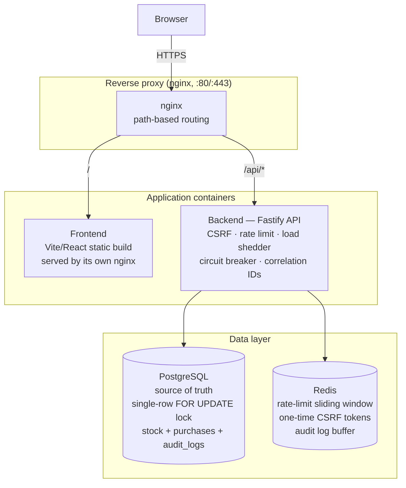

# Flash Sale — High-Throughput Purchase System

A flash sale platform for a single, limited-stock product: a configurable
sale window, one purchase per user, no overselling under concurrent load,
and a small React/Vite frontend to drive it. Backend is Fastify +
PostgreSQL + Redis.

```
POST /api/v1/purchase          → buy attempt
GET  /api/v1/status             → upcoming | active | ended, stock, countdown
GET  /api/v1/purchase-status    → did this user already secure one?
```

## Contents

- [How it works](#how-it-works)
- [System diagram](#system-diagram)
- [Project layout](#project-layout)
- [Running it](#running-it)
- [Testing](#testing)
- [API reference](#api-reference)
- [CI/CD](#cicd)
- [Known limitations](#known-limitations)

## How it works

**No overselling.** One product row, one Postgres transaction per purchase
attempt:

```sql
SELECT id, stock, version FROM flash_sale_items ORDER BY created_at ASC LIMIT 1 FOR UPDATE;
-- already purchased by this user? → reject
-- stock <= 0?                     → reject
UPDATE flash_sale_items SET stock = stock - 1, version = version + 1 ...;
INSERT INTO purchases (user_id, item_id, correlation_id) ...;
```

`FOR UPDATE` serializes every purchase attempt in the system through this
one row lock — there's no window where two requests can both see `stock = 1`
and both decrement it. Everything else (rate limiting, CSRF, circuit
breaker) protects the system from abusive load; this lock is what actually
prevents overselling.

**One purchase per user** is checked inside that same locked transaction, so
it can't race either. A `UNIQUE (user_id, item_id)` constraint backs it up
as defense-in-depth.

**Why Postgres, not Redis, is the source of truth:** an in-memory decrement
trades durability for speed — a failover or unflushed AOF window can lose or
double-count purchases. Postgres row locking is durable and plenty fast
here (~700 req/s locally, see [Testing](#testing)). Redis instead handles
things that are fine to be best-effort: per-user rate limiting (sliding
window), one-time CSRF tokens, and an audit-log buffer mirrored into
Postgres.

**Circuit breaker & load shedder** (`middleware/`) cap in-flight requests
and short-circuit new ones after a run of 5xx failures, so the process
degrades gracefully instead of falling over. Only real 5xx faults trip the
breaker — routine 4xx rejections like "out of stock" don't count.

**Frontend** talks to `/api` on its own origin only — Vite proxies it in
dev, nginx proxies it in the containerized stack — so there's no CORS on
the common path. No UI framework; plain CSS keeps it small and auditable.

## System diagram



nginx routes by path — `/` to the static frontend, `/api/*` to the backend
— so the browser only ever talks to one origin. PostgreSQL is the only
place stock is ever decremented (see [How it works](#how-it-works)); Redis
backs everything else that's fine to be best-effort.

## Project layout

```
packages/
  server/    Fastify API (TypeScript) — see src/{routes,services,repositories}
  frontend/  Vite + React UI (TypeScript)
docker-compose.yml       Postgres + Redis only, for local `npm run dev`
docker-compose.prod.yml  Full self-contained stack: nginx + frontend + backend + its own Postgres/Redis
nginx.conf               Reverse-proxy config used by docker-compose.prod.yml
infra/aws/               CloudFormation stack for deploying to ECS Fargate
```

## Running it

Uses Node 20 (see `.nvmrc`, matches the Dockerfiles and CI) — `nvm use` if
you have nvm installed.

**Local dev (hot reload):**

```bash
docker compose up -d postgres redis     # infra only
npm install                             # installs both workspaces
npm run dev                             # backend on :3001, frontend on :3000
```

Open http://localhost:3000. The sale window defaults to starting 1 minute
after the backend boots and running for 5 minutes — see `.env.example` to
pin an explicit window.

**Frontend only** (renders fine with no backend; polls and recovers
automatically once one appears):

```bash
npm run dev:frontend
```

**Full containerized stack** (nginx + both apps + their own Postgres/Redis):

```bash
docker compose -f docker-compose.prod.yml up -d --build
```

Open http://localhost.

## Testing

```bash
docker compose up -d postgres redis     # tests run against the real DB, not mocks
npm test
```

Integration tests exercise the real Fastify app against real Postgres/Redis
and include two concurrency proofs:

- **No oversell**: 70 concurrent purchase attempts (distinct users) against
  20 units of stock — exactly 20 succeed, DB state matches exactly.
- **One-per-user under a race**: 5 concurrent attempts, same user — exactly
  1 succeeds.

**Stress test** drives real HTTP traffic at a running server instance:

```bash
npm run test:stress -- --stock=200 --users=1000 --concurrency=200
```

A local run (150 stock, 750 competing users) sustained ~690 req/s with both
invariants holding exactly — successes matched available stock, and exactly
one purchase won a 25-way same-user race. Throughput is bounded by the
Postgres row lock by design; the fix for more scale is horizontal backend
scaling (the lock lives in Postgres, not in-process) rather than relaxing
the locking.

## API reference

| Method | Path                     | Notes                                             |
| ------ | ------------------------ | -------------------------------------------------- |
| GET    | `/api/v1/status`         | `{ item, status, saleActive, stockRemaining, timeRemaining }` |
| GET    | `/api/v1/csrf-token`     | One-time token, required by `/purchase`            |
| POST   | `/api/v1/purchase`       | `{ userId, csrfToken }`                             |
| GET    | `/api/v1/purchase-status?userId=` | `{ hasPurchased, purchaseId? }`           |
| GET    | `/health`, `/metrics`    | Liveness + Prometheus-style metrics                 |
| GET    | `/admin/metrics`, `/admin/purchase-log` | Require `X-Admin-Key` header          |
| GET    | `/docs`                  | Swagger UI                                          |

Full interactive docs at `/docs` once the backend is running.

## CI/CD

`.github/workflows/deploy-aws.yml` runs on every push and PR to `main`:
lint, type-check, and the full test suite (including the concurrency
proofs) against real Postgres/Redis service containers. On a direct push to
`main`, and only after tests pass, it builds both images, pushes to ECR,
and rolls the ECS services over — see [infra/aws](infra/aws) for the
CloudFormation stack it deploys to.

## Known limitations

- **Single-item-row model**: the locking strategy assumes one product row.
  Correct for this spec, but wouldn't generalize to multi-SKU without
  per-item locking.
- **In-process circuit breaker / load shedder / metrics**: per-instance by
  design — they protect *this process* and are on the hot path, so moving
  them to Redis would add a round trip to every request. Rate limiting is
  the exception and *is* Redis-backed, so it stays correct across replicas.
- **No admission control ahead of the database**: every attempt is
  serialized through one row lock, which is correct and fast enough here.
  At ~100x this traffic, the next step is a "waiting room" (ticket queue)
  in front of the lock — not needed at this scale.
- **Dependency versions**: a few packages (Fastify 4.x among them) have
  advisories that only resolve via a major-version bump — left as a
  deliberate follow-up rather than rushed in.
